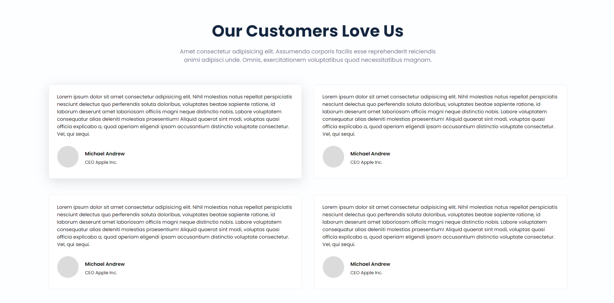

# Hosting Landing Page

## :link: [See it live](https://fullstack-js-bc-project-11.netlify.app/)

## :clipboard: Learning Outcomes 

- Gradiant backgrounds of buttons
- Gradiant borders of buttons by using CSS `mask` property
- Gradiant text colors with the use of CSS `background-clip` property

## :camera: Screenshot

